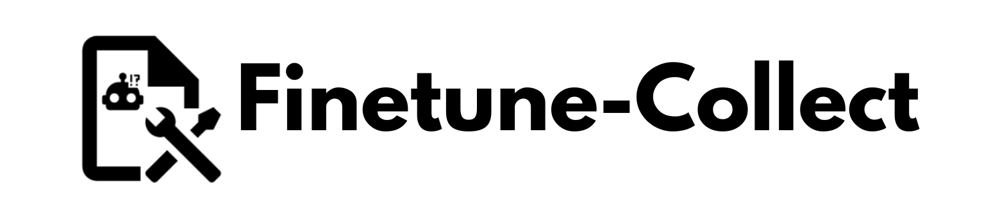
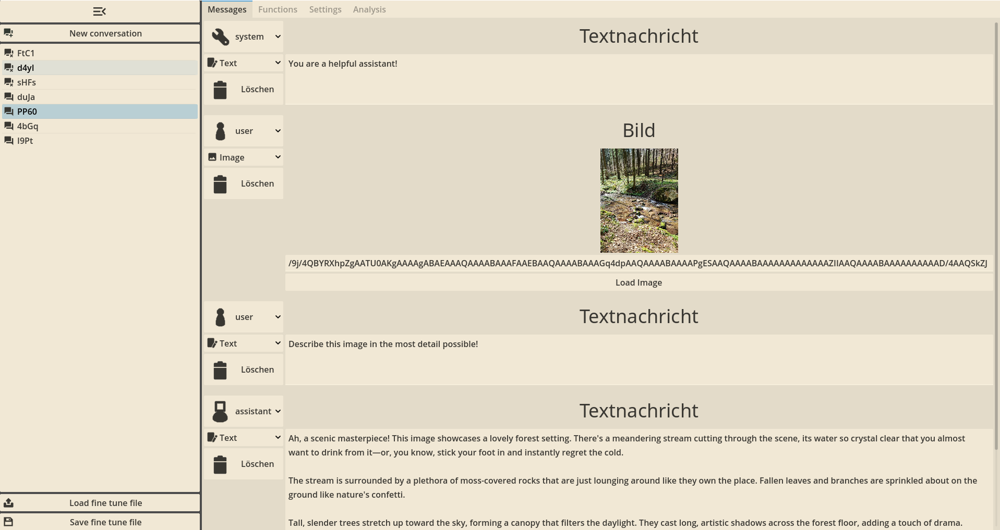
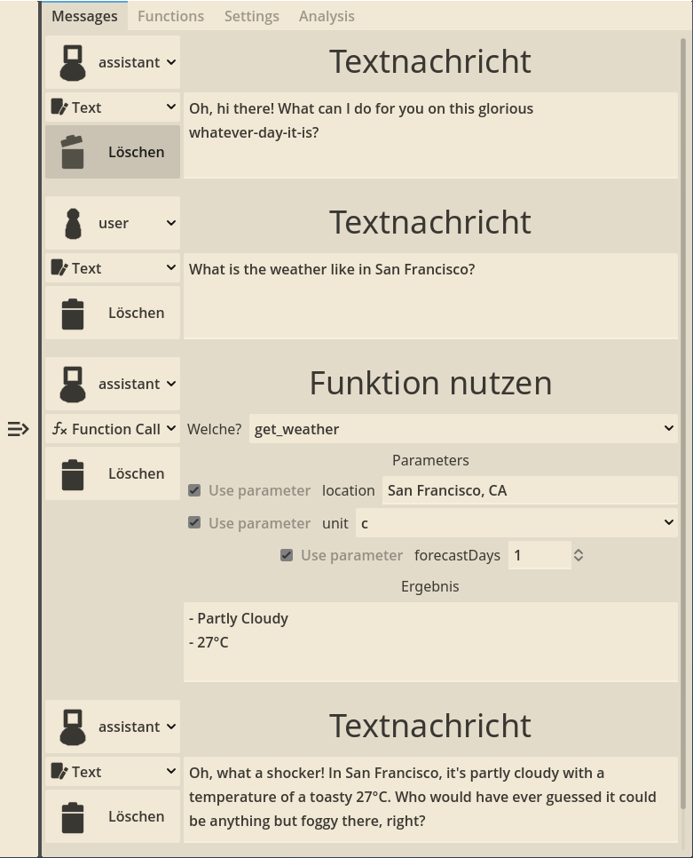

# 
A program that helps collecting and curating OpenAI fine-tune data.

This is a program for people that want to collect and curate their fine tuning data by hand. It provides functionality to store and modify example conversations and functions that will then be exported to the `.jsonl`-Format that the OpenAI API requires for fine-tuning.

You can also provide the program with your OpenAI API key and it can generate responses for you that you then can then adapt instead of completely writing them by hand.

## [Try it online on GitHub Pages](https://wielandb.github.io/finetune-collect/export/web)

## Usage

- `Ctrl` + `S`- Save fine tune project file without re-opening save dialog
- `Del` - Delete a conversation (when selected in the conversation overview)
- `Ctrl` + `Left Click` - Enlarge Image (when hovering image)
- `Crtl` + `Right Click` - Smallen Image (when hovering image)
- `Ctrl` + `Space` - Add new message
- Drag and drop a `.ftproj` or `.json` file onto the window to load a project or insert messages
- The application remembers the last opened project file and loads it automatically on the next start if it still exists
