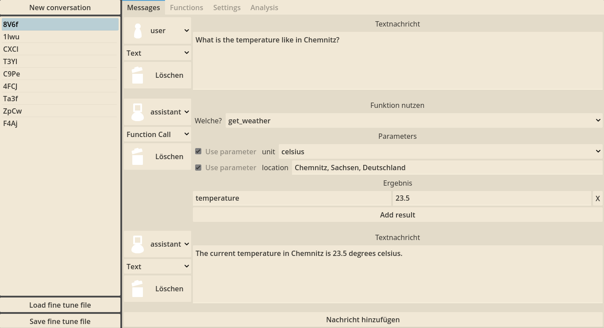
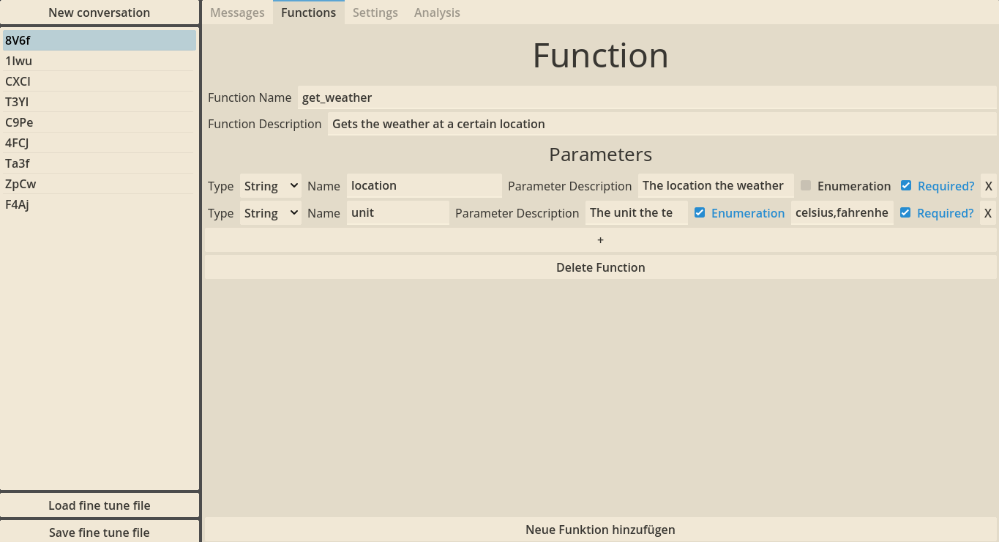

# finetune-collect
A program that helps collecting and curating OpenAI fine-tune data.

This is a program for people that want to collect and curate their fine tuning data by hand. It provides functionality to store and modify example conversations and functions that will then be exported to the `.jsonl`-Format that the OpenAI API requires for fine-tuning.

